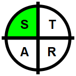
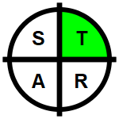
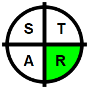

```{r setup}
#| include: false

knitr::opts_chunk$set(echo = FALSE, message = FALSE)

# default NHS logo
if (logo_path == "nhs") {
  logo_path <- "../img/NHS_logo.jpg"
}

cols_header_text <- paste0(
  "<div class='px-10'>
  <div class='icon_titles'>
  <div class='spc_logo'>Varia-tion</div>
  <div class='spc_logo'>Assur-ance</div>",
  if (include_dq_icon) "<div class='spc_logo'>Data Quality</div>",
  "</div>
  </div>")

```

```{r fun}
v_icon_path <- function(x) glue::glue("../img/variation_icons/{x}.png")
v_labs <- c(paste(paste("SC", rep(c("HI", "LO"), 3), sep = "_"),
  c("CON", "IMP", "NEUTRAL"),
  sep = "_"
), "CC")
v_paths <- purrr::map(v_labs, v_icon_path) |>
  purrr::set_names(v_labs)
a_icon_path <- function(x) glue::glue("../img/assurance_icons/{x}.png")
a_labs <- paste0(c("PASS", "RND", "FAIL"), "_TARG")
a_paths <- purrr::map(a_labs, a_icon_path) |>
  purrr::set_names(a_labs)
```

<style type="text/css">
  body { background-color: `r paper_colour`; }
  #logo_block .department h5 { color: `r department_text_colour`; }
  #main_content summary { background-color: `r accordion_colour`; }
  .fresh { background-color: `r fresh_colour`; }
  .stale { background-color: `r stale_colour`; }
</style>

:::: {#header_bar}
::: {#title_data}

# `r report_title`

## `r subtitle`

#### Report reference: `r report_ref`

#### Report creation date-time: `r format.Date(Sys.time(), "%d/%m/%Y, %H:%M %p")`

#### Data cutoff date-time: `r format.Date(data_cutoff_dttm, "%d/%m/%Y, %H:%M %p")`

:::

::: {#logo_block}
\

##### `r department` {.department}
:::

::::

## Notes:

`r intro`

A key explaining how to read the icons for Variation, Assurance, and Data Quality is at the [bottom of this document](#icon-key).


```{r map-over-data}
knit_out_list <- data_bundle_full |>
  purrr::pmap(knitr::knit_expand, file = "details_template.Rmd", .progress = "HTML charts")

knit_out <- knitr::knit_child(text = knit_out_list, quiet = TRUE)
```

::: {#main_content}

```{r main-content}
#| results: asis

cat(knit_out, sep = "  \n")

```

:::

---

:::: {#icon-key}

<details>
  <summary>
    <h4 class="summary_title";>
      How to read the icons used in this document
    </h4>
  </summary>


::: {.details_content}


#### SPC Variation Icons

Used to summarise the type of variation seen in the most recent data point of a given measure.

| Icons | Variation Type |
|:-----:|:---------------|
  | The most recent data point exhibits special cause variation (in a concerning direction).  H is high, L is low.
  | The most recent data point exhibits special cause variation (in an improving direction).  H is high, L is low.
  | The most recent data point exhibits special cause variation, but neither direction represents concern or improvement (ie. the measure is neutral).  H is high, L is low.
 | The most recent data point exhibits common cause variation (ie. naturally-occurring variation, that is not statistically significant).

#### SPC Assurance Icons

Used to summarise whether a measure is assured to meet a target.

| Icons | Assurance Type |
|:-----:|:---------------|
 | The process is assured, and is likely to consistently pass the target set.
 | The process is not assured, and will pass and fail the target based on variation in the process.
 | The process is not assured, and is likely to consistently fail to meet the target set.

```{r results="asis"} 
if(include_dq_icon){
cat("
\\newpage

#### Data Quality Icons

Used to summarise the data quality status of a given measure, across the four domains detailed below:

| Icons    | Domain | Summary | Detail                                             |
|:--------:|:---:|:------:|:-------------------------------------------------------|
|  | S | Sign-off and Validation       | Is there a named accountable person, who can sign off the data as a true reflection of the activity?  Has the data been checked for validity and consistency? Is there exec-level oversight of this process? |
|  | T | Timely & Complete             | Is the data available and up to date at the time of the submission or publication? Are all elements of required information present in the designated data source, and no elements need to be changed at a later date? |
|  | A | Audit & Accuracy              | Are processes in place for either external or internal audits of the data, and are these regularly scheduled (eg. quarterly, annually)? Are accuracy checks built into the data collection and reporting processes? |
|  | R | Robust systems & Data-capture | Are there robust systems which have been documented according to data dictionary standards for data capture such that it is at a sufficiently granular level? |
")}
```

:::

</details>

::::

---

::: {#footer}

Report reference: `r report_ref`

Report author:  `r author_name` [`r author_email`](`r paste0("mailto:", author_email, "?subject=Report ", report_ref)`)

<details id="session-info">

<summary>Session metadata for report author</summary>

```{r session-info}
utils::sessionInfo()
```

</details>

:::
