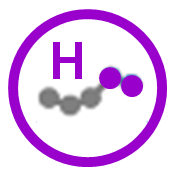

```{r setup, include=FALSE}
knitr::opts_chunk$set(echo = TRUE)

# do all spc calculations and store the result in a dataframe
# this data_bundle includes the ggplot chart objects, as well as various
# columns to make report authoring easier
data_bundle <- spcr_make_data_bundle(data_wide, config)

```

```{r echo=FALSE, results='asis'}

# title block

```

**Notes:**  
A key explaining how to read the icons for Variation, Assurance, and Data Quality is at the [bottom of this document.](#icon-key)

```{r echo=FALSE, fig.height=4, fig.width=7, message=FALSE, results='asis'}

# main report render

# add the header bar
spcr_add_header_bar()

# add the charts
walk(1:10, ~ print(data_bundle[.,][["Chart"]]))

```

---

<details>
  <summary>
    <h4 class = "outer_flex" id="icon-key" style = "justify-content: flex-start">
    How to read the icons used in this document
    </h4>
  </summary>
  <div class = "details_content">

**SPC Variation Icons**

Used to summarise the type of variation seen in the most recent data point of a given measure.  

Icons | Variation Type | 
:----:|:---------------|
  | The most recent data point exhibits special cause variation (in a concerning direction).  H is high, L is Low.  
  | The most recent data point exhibits special cause variation (in an improving direction).  H is high, L is Low.  
  | The most recent data point exhibits special cause variation, but neither direction represents concern or improvement (ie. the measure is neutral).  H is high, L is low.  
 | The most recent data point exhibits common cause variation (ie. naturally-occurring variation, that is not statistically significant).  
 
 ---

**SPC Assurance Icons**

Used to summarise whether a measure is assured to meet a target.  

Icons | Assurance Type
:----:|:---------------
 | The process is assured, and is likely to consistently pass the target set.  
 | The process is not assured, and will pass and fail the target based on variation in the process.
 | The process is not assured, and is likely to consistently fail to meet the target set.  

  </div>
</details>

---
Report owner:  
Data owners:  
Report reference:  
